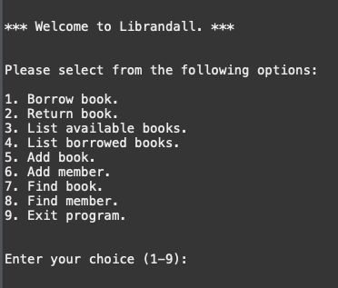

# Welcome to Librandall

> Thank you for stumbling upon this page. I created this project in preparation for an upcoming course on software testing for my master's degree.

> I must say, it was good to get back to my roots and write good ol' Java using the Eclipse IDE.

If you're in dire need of a Library Management System that uses an in-memory database and runs exclusively on a coding editor that makes your computer sound like it's taking off into the next dimension, you've come to the right place!

## Clone this Repository

That's the first logical step when it comes to these kinds of things.

Open a terminal somewhere on your computer, ideally somewhere you can see, and enter the following command into its deep, murky depths:

```
git clone https://github.com/AlexAlBasosi/Librandall.git
```

This will tell your computer to tell a bunch of other computers to download the code stored into this repository onto your computer, where the real magic can begin.

## Run the Application

Now, there are probably a dozen ways you can run a java program. You could probably run it on a vending machine if you so desire.

> A Book vending machine?! Is this a crossover episode?

However, I'm going to disappoint you all (like I did both my parents) by showing you how to run it on Eclipse.

### Download Eclipse

If you don't know what Eclipse is, (hint, it doesn't involve any stars or planets, unfortunately), it's an Integrated Development Environment (IDE), which is a fancy corporate way of saying an application that allows you to build other applications.

And if you're familiar with building applications or have been a software engineer in any capacity within the last quarter of a century, then you'll know just how big and clunky these IDEs can be.

> So much so that I've dedicated five paragraphs to ranting about it rather than actually show you how it works.

If you don't have Eclipse installed on your computer, you might be able to find it here: [Eclipse Download](https://www.eclipse.org/downloads/packages/).

### Run the Application

Once you've downloaded, installed, gone through the various wizards, completed the various quests, and somehow managed to end up with Eclipse running and open on your desktop, then you can open this project on Eclipse.

Under `src` > `ui`, run the following file,

```
Librandall.java
```

by right-clicking on the file, selecting `Run As` and then `1 Java Application`.

And you should see the `Console` load up with the following text appear on the screen:



And you can interact with the application as you see fit.

## What's Next?

I could at some point migrate this codebase to a Spring Boot Rest API application and hook it up to a PostgreSQL database and run it on a Kubernetes cluster on a Cloud somewhere, and then build a comprehensive React-based front-end application that can allow users to interact with the Library Management Service in real-time.

I could also migrate this to Android studio and build a good ol' Java-based Android app.

I could do all these things.

But I probably won't. Ain't nobody got time for dat.
